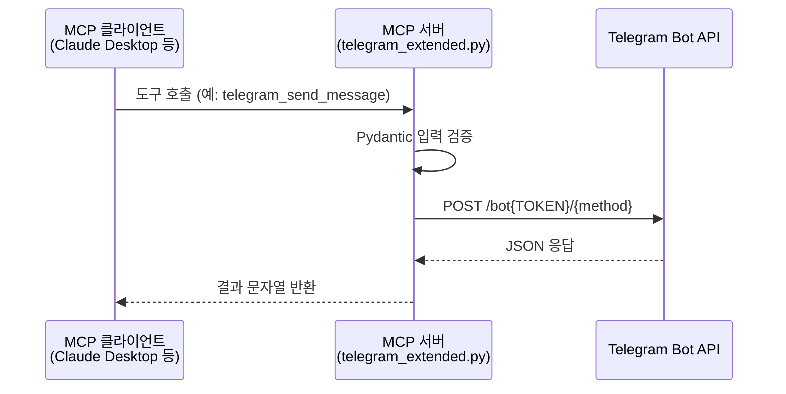
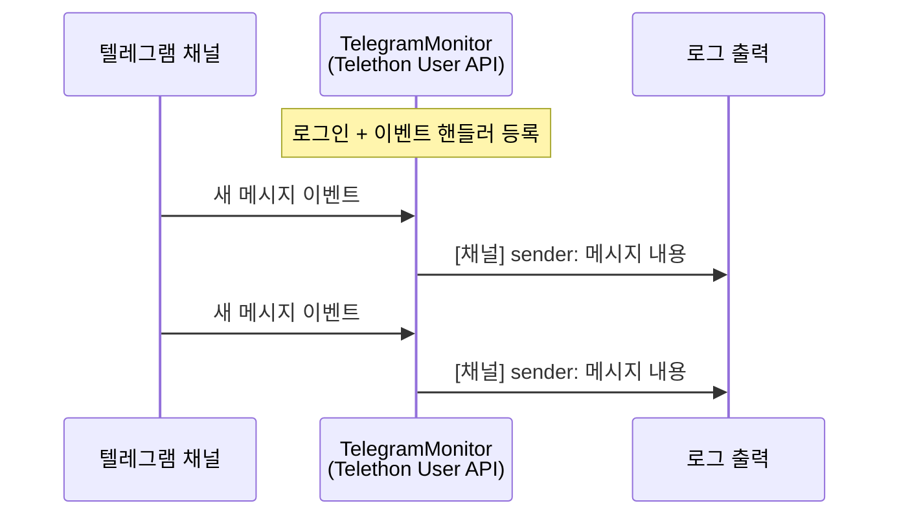
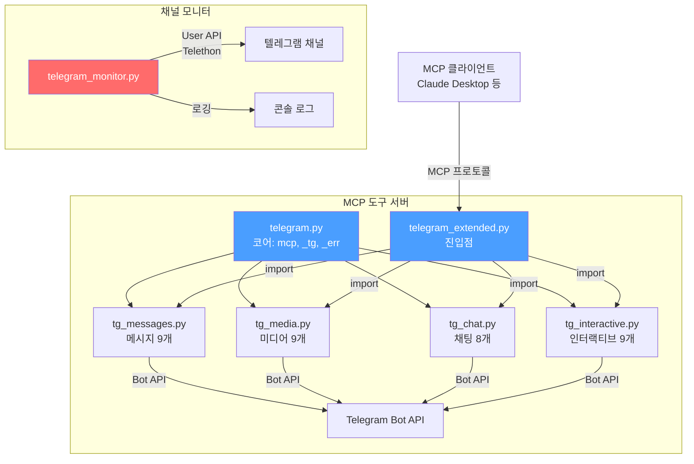

# Telegram MCP Server & Channel Monitor

Telegram Bot API 기반 MCP 도구 서버 + Telethon User API 기반 채널 실시간 모니터링 시스템.

---

## 📁 파일 구조

```
.
├── telegram.py           # 코어 모듈 (mcp, _tg, _err)
├── tg_messages.py        # 메시지 CRUD 도구 (9개)
├── tg_media.py           # 미디어 전송 도구 (9개)
├── tg_chat.py            # 채팅 정보/관리 도구 (8개)
├── tg_interactive.py     # 인터랙티브/유틸 도구 (9개)
├── telegram_extended.py  # MCP 서버 진입점 (총 35개 도구)
├── telegram_monitor.py   # 채널 실시간 모니터링 (메시지 로깅)
├── .env                  # 환경변수 (git 미추적)
├── .env.example          # 환경변수 템플릿
├── pyproject.toml        # 의존성 관리
└── README.md             # 이 문서
```

---

## 1. 환경 설정

### .env 파일 생성

```bash
cp .env.example .env
```

`.env`에 아래 값들을 설정합니다:

| 변수 | 용도 | 사용처 |
|------|------|--------|
| `TELEGRAM_BOT_TOKEN` | Bot API 토큰 (@BotFather 발급) | telegram.py |
| `TELEGRAM_API_ID` | User API 앱 ID (my.telegram.org) | telegram_monitor.py |
| `TELEGRAM_API_HASH` | User API 앱 해시 | telegram_monitor.py |
| `TELEGRAM_PHONE` | 로그인 전화번호 (+821012345678) | telegram_monitor.py |

### 패키지 설치

```bash
uv sync
```

---

## 2. 실행

### MCP 서버 (35개 도구)

```bash
uv run telegram_extended.py
```

### 채널 모니터링

```bash
uv run telegram_monitor.py
```

> 최초 실행 시 Telethon 로그인 인증(전화번호 → 인증코드)이 필요합니다.
> 이후 `telegram_session.session` 파일에 세션이 저장되어 자동 로그인됩니다.

---

## 3. MCP 도구 목록 (35개)

### 3-1. 메시지 CRUD — `tg_messages.py` (9개)

| 도구 | API | 설명 |
|------|-----|------|
| `telegram_send_message` | sendMessage | 텍스트 메시지 전송 (Markdown/HTML) |
| `telegram_get_updates` | getUpdates | 봇 수신 메시지 조회 (offset 중복 방지) |
| `telegram_edit_message` | editMessageText | 메시지 수정 |
| `telegram_delete_message` | deleteMessage | 메시지 삭제 |
| `telegram_delete_messages` | deleteMessages | 메시지 복수 삭제 |
| `telegram_forward_message` | forwardMessage | 포워드 (출처 표시) |
| `telegram_forward_messages` | forwardMessages | 복수 포워드 |
| `telegram_copy_message` | copyMessage | 복사 (출처 없음) |
| `telegram_copy_messages` | copyMessages | 복수 복사 |

### 3-2. 미디어 전송 — `tg_media.py` (9개)

| 도구 | API | 설명 |
|------|-----|------|
| `telegram_send_photo` | sendPhoto | 사진 전송 |
| `telegram_send_document` | sendDocument | 파일/문서 전송 |
| `telegram_send_video` | sendVideo | 동영상 전송 |
| `telegram_send_audio` | sendAudio | 오디오 전송 |
| `telegram_send_voice` | sendVoice | 음성 메시지 전송 |
| `telegram_send_animation` | sendAnimation | GIF/애니메이션 전송 |
| `telegram_send_video_note` | sendVideoNote | 둥근 비디오 전송 |
| `telegram_send_media_group` | sendMediaGroup | 미디어 그룹(앨범) 전송 |
| `telegram_send_sticker` | sendSticker | 스티커 전송 |

### 3-3. 채팅 정보/관리 — `tg_chat.py` (8개)

| 도구 | API | 설명 |
|------|-----|------|
| `telegram_get_chat` | getChat | 채팅 상세 조회 |
| `telegram_get_chat_members_count` | getChatMemberCount | 멤버 수 조회 |
| `telegram_get_me` | getMe | 봇 정보 조회 |
| `telegram_pin_message` | pinChatMessage | 메시지 고정 |
| `telegram_unpin_message` | unpinChatMessage | 고정 해제 |
| `telegram_ban_user` | banChatMember | 사용자 차단 |
| `telegram_unban_user` | unbanChatMember | 차단 해제 |
| `telegram_send_chat_action` | sendChatAction | 채팅 액션 전송 (입력 중...) |

### 3-4. 인터랙티브/유틸 — `tg_interactive.py` (9개)

| 도구 | API | 설명 |
|------|-----|------|
| `telegram_send_poll` | sendPoll | 투표 생성 |
| `telegram_send_with_buttons` | sendMessage (inline_keyboard) | 인라인 버튼 메시지 |
| `telegram_answer_callback_query` | answerCallbackQuery | 콜백 쿼리 응답 |
| `telegram_send_location` | sendLocation | 위치 전송 |
| `telegram_send_venue` | sendVenue | 장소 전송 |
| `telegram_send_contact` | sendContact | 연락처 전송 |
| `telegram_send_dice` | sendDice | 주사위/랜덤 전송 |
| `telegram_set_message_reaction` | setMessageReaction | 메시지 리액션 |
| `telegram_get_file` | getFile | 파일 정보/다운로드 URL 조회 |

### 3-5. 채널 모니터 — `telegram_monitor.py`

지정한 텔레그램 채널의 메시지를 실시간 수신하여 로그로 기록합니다.

모니터링할 채널은 `telegram_monitor.py`의 `Config.MONITOR_CHANNELS` 리스트에 직접 추가합니다.

---

## 4. 시퀀스 다이어그램

### 4-1. MCP 도구 서버 흐름



### 4-2. 채널 모니터 흐름



### 4-3. 전체 시스템 구성도



---

## 5. MCP 클라이언트 연결

`claude_desktop_config.json`에 추가:

```json
{
  "mcpServers": {
    "telegram": {
      "command": "uv",
      "args": ["run", "/path/to/telegram_extended.py"],
      "env": {
        "TELEGRAM_BOT_TOKEN": "your_bot_token_here"
      }
    }
  }
}
```

---

## 6. chat_id 확인 방법

| 대상 | 방법 |
|------|------|
| 본인 ID | [@userinfobot](https://t.me/userinfobot) 에 `/start` |
| 그룹 ID | 그룹에 `@userinfobot` 초대 후 `/start` |
| 채널 ID | [web.telegram.org](https://web.telegram.org) URL에서 숫자 확인 |

그룹·채널 ID는 보통 음수(예: `-1001234567890`)입니다.

---

## 7. 주의사항

- 그룹·채널 관리 도구(`pin`, `ban` 등)는 봇 **관리자 권한** 필요
- `telegram_get_updates`는 Webhook과 동시 사용 불가
- Bot API 속도 제한: 동일 채팅 초당 1건, 분당 20건 이하 권장
- `telegram_monitor.py`는 User API 사용 → 개인 계정 로그인 필요 (봇 아님)

---

## Contributors

| 이름 | 역할 |
|------|------|
| **Gayeon Lee** ([@ruchiayeon](https://github.com/ruchiayeon)) | Creator & Developer |
| **Claude** (Anthropic) | AI Pair Programmer |

---

# AI Instructions (LLM Context)

> 이 섹션은 AI 에이전트가 이 프로젝트를 이해하고 작업할 때 참고하는 구조화된 컨텍스트입니다.

## Project Overview

- **프로젝트명**: Telegram MCP Server & Channel Monitor
- **언어**: Python 3.14+
- **패키지 매니저**: uv
- **핵심 의존성**: httpx, mcp (FastMCP), pydantic, telethon, python-dotenv


## Architecture

```
telegram.py (코어 모듈)
  ├── BOT_TOKEN: .env에서 로드
  ├── mcp = FastMCP("telegram_mcp")  ← 공유 인스턴스
  ├── _tg(): httpx로 Telegram Bot API 호출하는 공통 함수
  └── _err(): 예외 → 사용자 친화적 에러 문자열 변환

tg_messages.py (메시지 CRUD 9개 도구)
  ├── send_message, get_updates, edit, delete, delete_messages
  └── forward, forward_messages, copy, copy_messages

tg_media.py (미디어 전송 9개 도구)
  └── photo, document, video, audio, voice, animation, video_note, media_group, sticker

tg_chat.py (채팅 관리 8개 도구)
  └── get_chat, members_count, get_me, pin, unpin, ban, unban, chat_action

tg_interactive.py (인터랙티브/유틸 9개 도구)
  └── poll, buttons, callback, location, venue, contact, dice, reaction, get_file

telegram_extended.py (진입점)
  ├── import tg_messages, tg_media, tg_chat, tg_interactive
  └── mcp.run()으로 실행 시 총 35개 도구 제공

telegram_monitor.py (독립 실행 스크립트)
  ├── Telethon User API 사용 (Bot API 아님)
  ├── Config 클래스: 모든 설정을 os.getenv()로 관리
  ├── TelegramMonitor 클래스:
  │   ├── _on_new_message(): NewMessage 이벤트 핸들러 (메시지 로깅)
  │   └── run(): 로그인 + 채널 이벤트 구독 + 연결 유지
  └── asyncio.run(monitor.run())으로 실행
```

## Key Patterns

- **모듈 분리 패턴**: `telegram.py`가 코어(`mcp`, `_tg`, `_err`)를 제공하고, 4개 도구 모듈(`tg_messages`, `tg_media`, `tg_chat`, `tg_interactive`)이 기능별로 도구를 등록. `telegram_extended.py`는 진입점으로 모든 모듈을 import 후 `mcp.run()` 실행.
- **입력 검증**: 모든 MCP 도구는 Pydantic BaseModel로 입력 검증 (`ConfigDict(extra="forbid")` 사용).
- **에러 처리**: `_err()` 함수로 httpx 예외를 사용자 친화적 한국어 문자열로 변환.
- **환경변수**: `.env` 파일 + `python-dotenv`로 관리. 민감 정보 코드에 하드코딩 없음.
- **비동기**: httpx.AsyncClient (MCP 서버), Telethon + asyncio (모니터).

## File Modification Rules

- `telegram.py` 수정 시: 4개 도구 모듈이 `mcp`, `_tg`, `_err`를 import하므로 이 인터페이스 유지 필요.
- 새 MCP 도구 추가 시: 해당 카테고리의 `tg_*.py` 파일에 Pydantic 모델 + `@mcp.tool()` 데코레이터로 추가.
- 새 카테고리 추가 시: `tg_newcategory.py` 생성 후 `telegram_extended.py`에 import 추가.
- 모니터링 채널 변경 시: `telegram_monitor.py`의 `Config.MONITOR_CHANNELS` 리스트 수정.

## Environment Variables

모든 환경변수는 `.env` 파일에서 로드됩니다. `.env.example` 참조.

| 변수 | 필수 | 사용 파일 | 설명 |
|------|------|-----------|------|
| `TELEGRAM_BOT_TOKEN` | MCP 서버 사용 시 | telegram.py | Bot API 토큰 |
| `TELEGRAM_API_ID` | 모니터 사용 시 | telegram_monitor.py | User API 앱 ID |
| `TELEGRAM_API_HASH` | 모니터 사용 시 | telegram_monitor.py | User API 앱 해시 |
| `TELEGRAM_PHONE` | 모니터 사용 시 | telegram_monitor.py | 로그인 전화번호 |
| `SESSION_NAME` | 선택 | telegram_monitor.py | 세션 파일명 (기본 telegram_session) |
